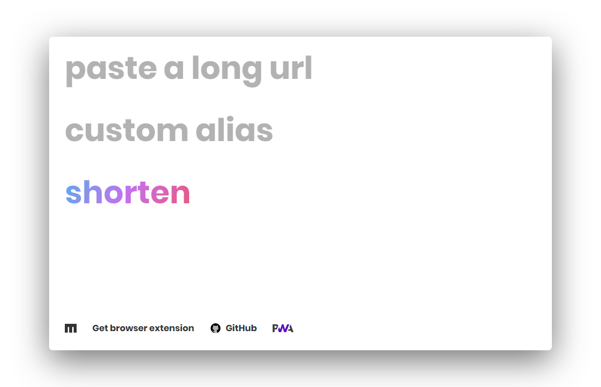
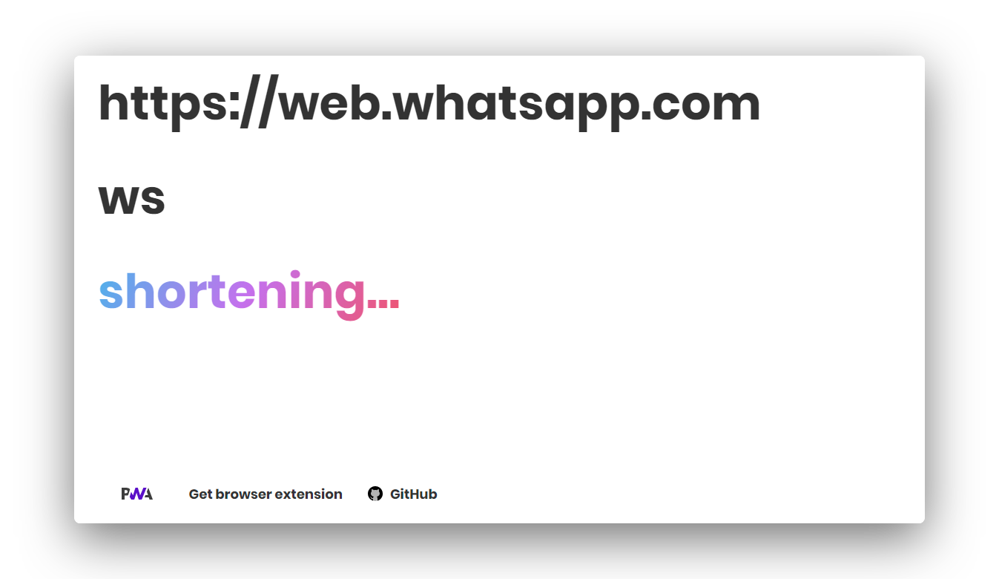

```
When I wrote this, only God and I understood what I was doing. Now, only God knows.
```
<div align="center">
  <a href="https://liyas-thomas.firebaseapp.com"></a>
  <br>
  <h1>Liyas Thomas</h1>
  <sub>Built with ❤︎ by
  <a href="https://github.com/liyasthomas">liyasthomas</a> and
  <a href="https://github.com/liyasthomas/mnmlurl/graphs/contributors">contributors</a>
	</sub>
</div>

---

[](https://travis-ci.org/liyasthomas/mnmlurl) [](https://github.com/liyasthomas/mnmlurl/releases/latest) [](https://github.com/liyasthomas/mnmlurl/archive/master.zip) [](https://github.com/liyasthomas/mnmlurl/blob/master/LICENSE) [](https://github.com/liyasthomas/mnmlurl/issues) [](https://liyas-thomas.firebaseapp.com) [](https://www.paypal.me/liyascthomas)

#  mnmlurl

### :link: Minimal URL is a modern URL shortener with support for custom alias by [Liyas Thomas](https://github.com/liyasthomas)

### Follow this tutorial to create your own URL shortener with support for custom alias & can be hosted even in GitHub pages: [How to create your own custom URL shortener in 10 minutes for free & deploy to GitHub 🚀](https://dev.to/liyasthomas/how-to-create-your-own-custom-url-shortener-in-10-minutes-for-free-deploy-to-github-2k6h)

<div align="center">
  <br>
  
  
  <br>
</div>

### Features :sparkles:

:heart_eyes: **URL shortning made simple**: mnmlurl uses [jsonstore.io](https://www.jsonstore.io) to  store data on an endpoint JSON file using HTTPS requests. It works on any url.

:heart: **No server side logging**: Your privacy is important for us. We never log, collect or prompt to sell your data to anyone.

:fire: **Custom and random alias support**: Add your own custom alias or generate a random one.

:1234: **Generate QR code**: Create and download shortened URL's QR code.

:alembic: **Manage URLs**: Delete already created alias to update/create new URLs.

:zap: **Performance**: mnmlurl is a thin web app on top of HTML, CSS and JavaScript. Being a Progressive web app, mnmlurl offers lightning fast loading and offline support via workbox and service worker.

:information_desk_person: **Browser extension**:  Get mnmlurl [Chrome browser extension](https://github.com/liyasthomas/mnmlurl-extension)

**Minimal URL can be hosted on any website hosting services like GitHub/GitLab pages, Firebase/Heroku hosting, yoursite.com, etc. For hosting in such custom domains, Its advised to `npm run-scripts build` and upload `output` folder. Hosting on GitHub pages was just for proof of concept.**

<span style="color:red;">**IMPORTANT: Minimal URL is an experimental project. Don't shorten sensitive contents/URLs with it. jsonstore.io endpoints are always public making shortened URLs visible for everyone.**</span>

---

## Demo

[liyasthomas.github.io/mnmlurl/src](https://liyasthomas.github.io/mnmlurl/src) _(development)_

---

## Built with

* HTML - For the web framework
* CSS - For styling components
* **[Chromium](https://github.com/chromium/chromium)** - Thanks for being so fast!

---

## Contributing

Please read [CONTRIBUTING](CONTRIBUTING.md) for details on our [CODE OF CONDUCT](CODE_OF_CONDUCT.md), and the process for submitting pull requests to us.

---

## Continuous Integration

We use [Travis CI](https://travis-ci.com) for continuous integration. Check out our [Travis CI Status](https://travis-ci.org/liyasthomas/mnmlurl).

---

## Versioning

This project is developed by [Liyas Thomas](https://github.com/liyasthomas) using the [Semantic Versioning specification](https://semver.org). For the versions available, see the [releases on this repository](https://github.com/liyasthomas/mnmlurl/releases).

---

## Authors

### Lead Developers
* [**Liyas Thomas**](https://github.com/liyasthomas) - *Author*

### Testing and Debugging
* [Liyas Thomas](https://github.com/liyasthomas)

### Contributors
* [Contributors](https://github.com/liyasthomas/mnmlurl/graphs/contributors)

See also the list of [contributors](https://github.com/liyasthomas/mnmlurl/graphs/contributors) who participated in this project.

---

## License

This project is licensed under the [MIT License](https://opensource.org/licenses/MIT) - see the [LICENSE](LICENSE) file for details.

---

## Change log

See the [CHANGELOG](CHANGELOG.md) file for details.

---

## Acknowledgments

* Hat tip to anyone who's code was used
* Inspirations:
	* [Glitch](https://glitch.com)
	* [tiny.cc](https://tiny.cc)
